# Семантическая структура страницы

## Statement of work 1

Добавить:

* в `body` элемент `header` с классом `page-header` и текстом `Хедер` 
* элемент `footer` с классом `page-footer` и текстом `Футер` 

### Result

## Statement of work 2

Добавить:

* между хедером и футером элемент `main` c текстом `Основное содержание` 

### Result

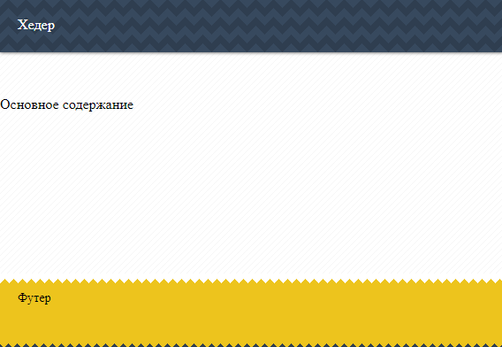

## Statement of work 3

Удалить:

* текст из `main` 

Добавить:

* внутрь `main` тег `article` с классом `about-me` и текстом `Обо мне` 
* тег `section` с классом `posts` и текстом `Последние посты` 

### Result

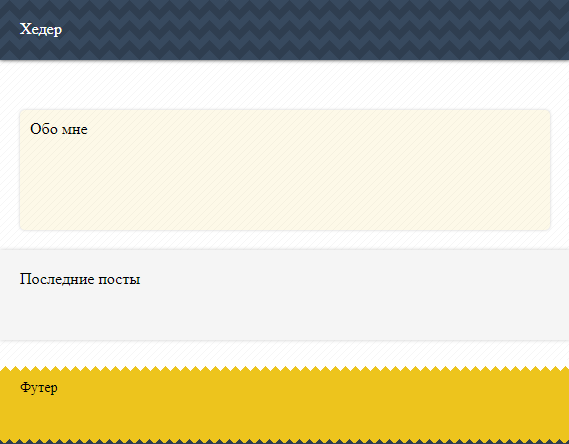

## Statement of work 4

Добавить:

* в хедер `div` с классом `logo` 
* внутрь дива изображение с адресом `/images/logo.svg` , шириной и высотой `90` пикселей

Увеличить:

* ширину и высоту этого изображения до `300` пикселей, размеры изображения задавать с помощью атрибутов тега `` 

### Result

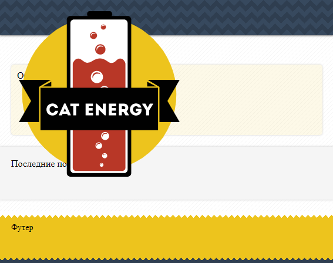

## Statement of work 5

Добавить:

* в хедер после логотипа тег `nav` с классом `main-menu` 
* внутрь `nav` неупорядоченный список из 3 пунктов: `Главная` , `Посты` , `Обо мне` 
* ссылку с произвольным адресом для текста каждого пункта

### Result

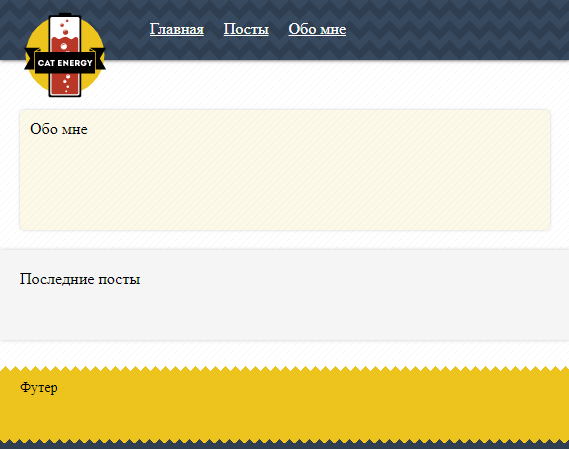

## Statement of work 6

Добавить:

* `section` с классом `info` для фото кота, его имени и адрес почты
* `section` с классом `copyright` для информации о копирайте

### Result

## Statement of work 7

Раскомментировать:

* тег `link` внутри `head` 

Задать:

* для `body` шрифт `"PT Sans", "Arial", sans-serif` 

### Result

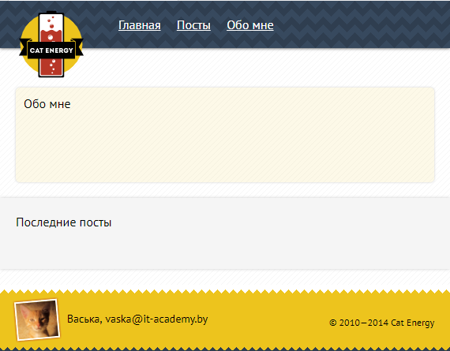

## Statement of work 8

Удалить:

* тег `link` внутри `head` 

Раскомментировать:

* правило `@font-face` в `CSS` 

Задать:

* для `body` шрифт `Roboto` 

### Result

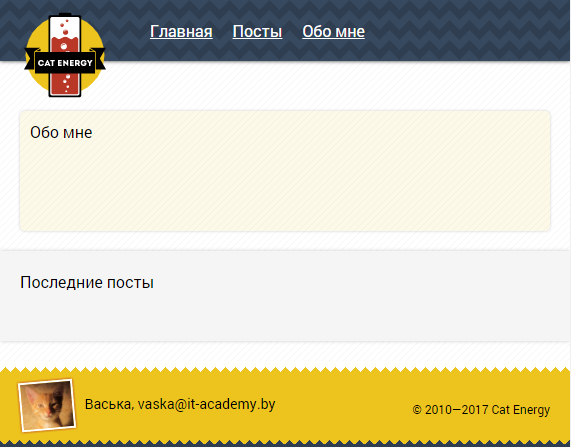

## Statement of work 9

Удалить:

* текст из раздела `about-me` 

Добавить:

* внутрь `about-me` тег `section` с классом `profile` и текстом `Личная информация` 
* после блока `.profile` тег `aside` с классом `last-actions` и текстом `Последняя активность` 

### Result

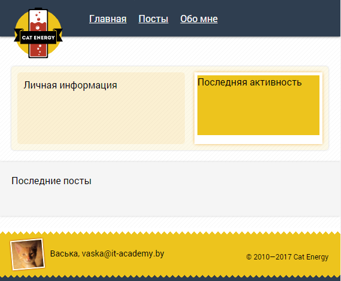

## Statement of work 10

Удалить:

* текст из раздела `posts` 

Добавить:

* внутрь `posts` тег `article` с классом `featured-post` 
* внутрь `featured-post` тег `header` 
* в `header` тег `h1` с текстом `Заголовок поста` 
* сразу после тега `header` тег `section` c текстом `Анонс поста` 

### Result

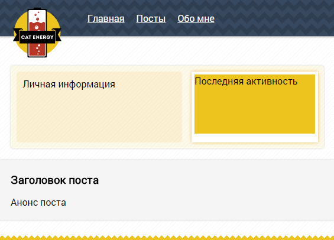

## Statement of work 11

Раскомментируйте код в разделах:

* `profile` 
* `last-actions` 
* `featured-post` 

### Result

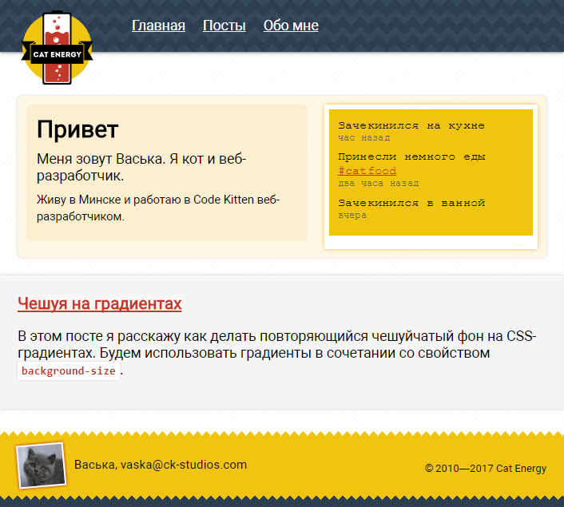

## Statement of work 12

Добавить:

* внутрь основного содержания статью с классом `post` 
* внутрь статьи хедер, а внутрь него заголовок первого уровня с текстом `Заголовок поста` 
* сразу после хедера раздел с классом `intro` и текстом `Введение` 
* после раздела `intro` раздел с классом `content` и текстом `Содержание поста` 

### Result

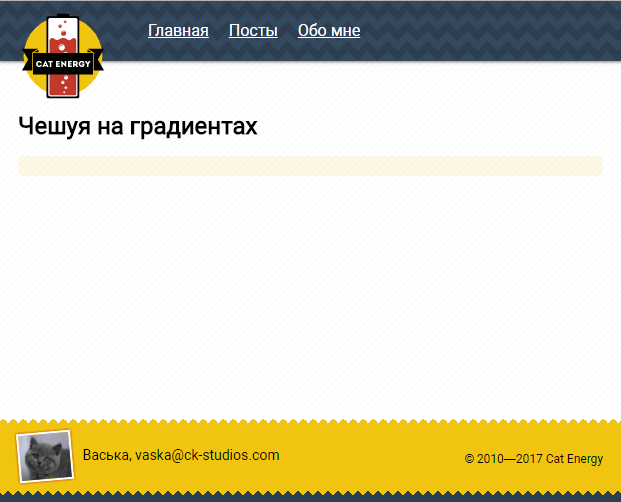

## Statement of work 13

Добавить:

* дату публикации в хедер поста после заголовка.Значение даты для людей 21 апреля 2020, а для машин 2020-04-21T11:00:00.

Раскомментировать:

* код введения поста.
* код содержания поста.

### Result

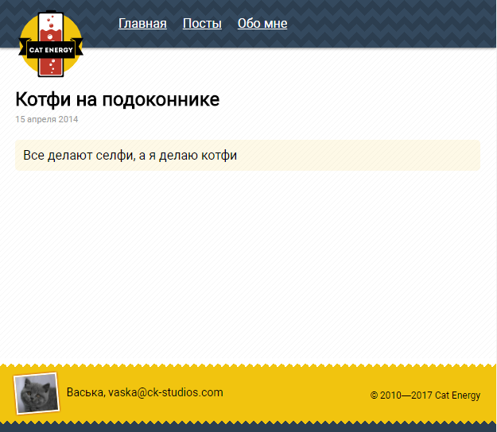

## Statement of work 14

Добавить:

* в содержание поста тег `figure` 
* внутрь него вставьте изображение с адресом `images/catmod.jpg` 
* подпись с текстом `Шерстяная модель` 

### Result

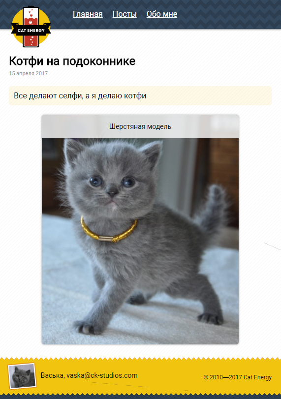

## Statement of work 15

Добавить:

* в содержание поста тег `video` 

Включить:

* у видео управляющую панель
* предзагрузку мета-информации, 

Задать:

* видеоролику ширину `400` и высоту `225` пикселей.

### Result

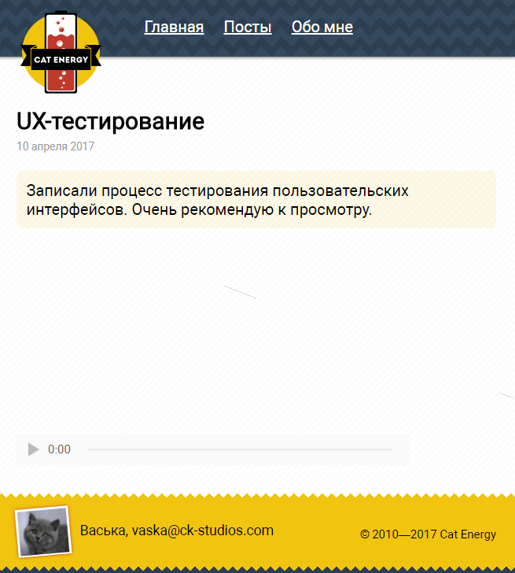

## Statement of work 16

Добавить:

* в видео первый источник с типом `video/mp4` и адресом `videos/rendering.mp4` 
* второй с типом `video/ogg` и адресом `videos/rendering.ogv` 
* третий с типом `video/webm` и адресом `videos/rendering.webm` 

### Result

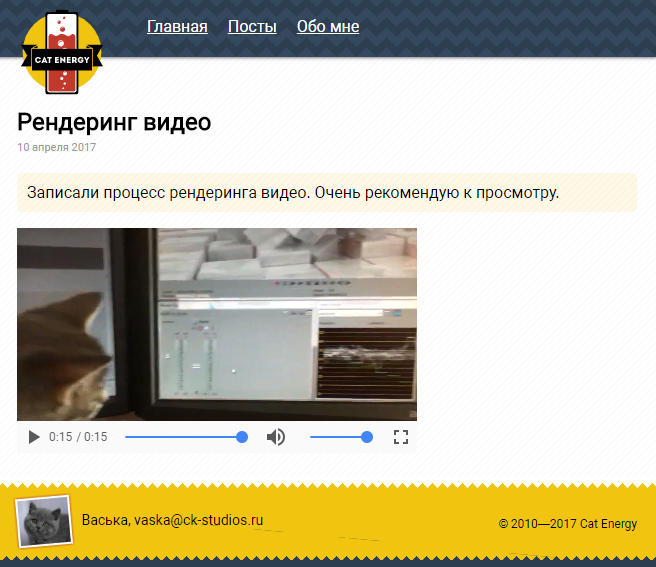

## Statement of work 17

Добавить:

* в содержание поста тег `audio` 

Включить:

* управляющую панель у тега `audio` 
* предзагрузку мета-информации у тега `audio` 

### Result

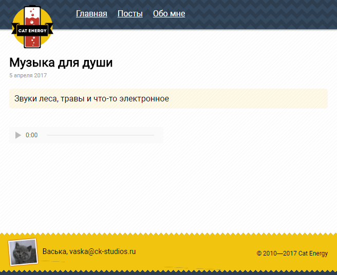

## Statement of work 18

Добавить:

* в аудио первый источник с типом `audio/mpeg` и адресом `sounds/sound.mp3` 
* второй с типом `audio/ogg` и адресом `sounds/sound.ogg` 

### Result

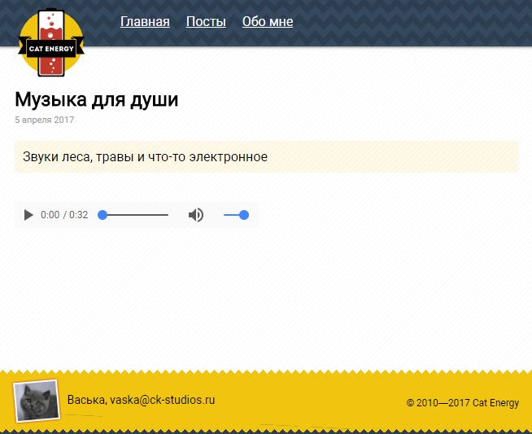

## Statement of work 19

Реализовать:

* верстку с использование макета `result` 

### Result

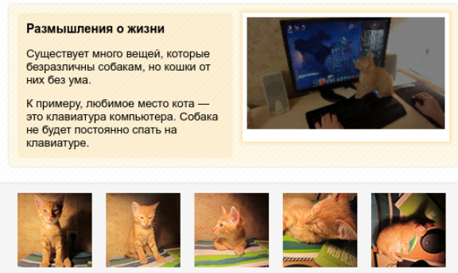

