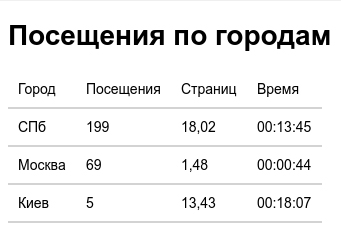
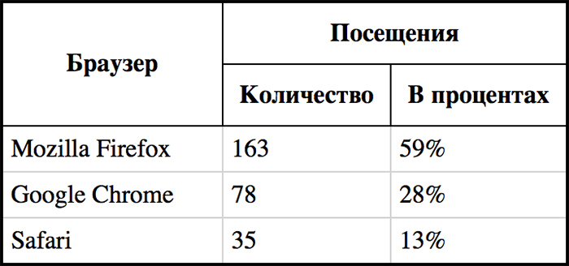
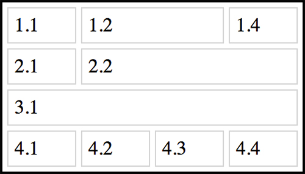
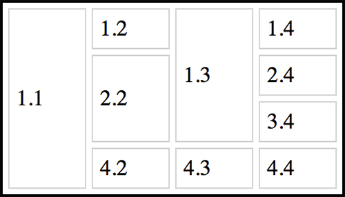
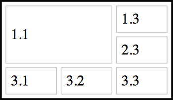
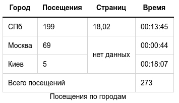
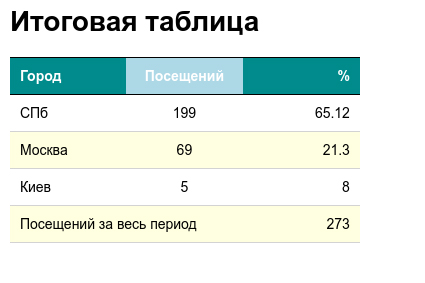

# Введение в таблицы

Из всех объектов, которые используются для разметки текста в интернете, таблицы являются самыми сложными для новичков.Действительно, табличные данные приходится публиковать достаточно часто.В отличие от списков, абзацев, заголовков, изображений с таблицами всегда возникает много проблем.

01. [Простейшая таблица](#statement-of-work-1)
02. [Добавляем строки](#statement-of-work-2)
03. [Добавляем столбцы](#statement-of-work-3)
04. [Задаём рамки с помощью `CSS` ](#statement-of-work-4)
05. [Улучшаем отображение рамок](#statement-of-work-5)
06. [Горизонтальные и вертикальные рамки](#statement-of-work-6)
07. [Отступы внутри ячеек](#statement-of-work-7)
08. [Отступы между ячейками](#statement-of-work-8)
09. [Самостоятельное задание 1](#statement-of-work-9)
10. [Ячейки-заголовки](#statement-of-work-10)
11. [Заголовок таблицы](#statement-of-work-11)
12. [Объединяем ячейки в строках](#statement-of-work-12)
13. [Объединяем ячейки в столбцах](#statement-of-work-13)
14. [Закрепление `colspan` ](#statement-of-work-14)
15. [Закрепление `rowspan` ](#statement-of-work-15)
16. [Комбо: `colspan` + `rowspan` ](#statement-of-work-16)
17. [Самостоятельная работа 2](#statement-of-work-17)
18. [Выравнивание содержимого в ячейках](#statement-of-work-18)
19. [Добавим цвета](#statement-of-work-19)
20. [Раскрашиваем строки](#statement-of-work-20)
21. [Задаём размеры таблицы](#statement-of-work-21)
22. [Задаём размеры отдельных ячеек и столбцов](#statement-of-work-22)
23. [Контрольная работа](#statement-of-work-23)

## Statement of work 1

### Простейшая таблица

### Task

* Уберите комментарий в коде редактора и посмотрите на простейшую таблицу из четырёх строк и двух колонок.

## Statement of work 2

### Добавляем строки
Простейшая таблица описывается с помощью трёх тегов:

* `<table>` обозначает таблицу
* `<tr>` расшифровывается как `table row` , обозначает строку таблицы
* `<td>` расшифровывается как `table data` , обозначает ячейку внутри строки таблицы

Теги `<td>` располагаются внутри тегов `<tr>` , а те, в свою очередь, внутри `<table>` .Почти всё текстовое содержимое таблицы размещается внутри тегов `<td>` .

В простейшей таблице в каждой строке должно быть одинаковое количество ячеек, то есть внутри всех `<tr>` должно быть одинаковое количество `<td>` .

### Task

Добавьте:

* в таблицу пятую строку со статистикой для браузера `Opera` , 
* шестую строку со статистикой для браузера `Internet Explorer` .

Количество посещений можете указать любое.

## Statement of work 3

### Добавляем столбцы
Со строками справились, теперь потренируемся добавлять в таблицу столбцы.
Для того, чтобы добавить столбец в таблицу, надо в каждую строку `<tr>` добавить по ячейке `<td>` .

В этом задании вам нужно будет в исходную таблицу добавить ещё два столбца.То есть в каждой строке должно быть по четыре ячейки.

### Task

Добавьте:

* в таблицу третий столбец `Операционная система` 
* и четвёртый столбец `Посещаемость в процентах` 

Значения в первой строке каждого столбца должны быть как в задании, значения в остальных ячейках можете указать любые.

## Statement of work 4

### Задаём рамки с помощью `CSS` 
Вы научились создавать простые таблицы, добавлять в них любое количество строк и столбцов.Теперь пришло время оформить эти таблицы.

Таблицы в предыдущих заданиях отображались с рамками по умолчанию.Такие рамки отображаются, если у тега `<table>` задан атрибут `border` с ненулевым значением.

Но с помощью атрибута `border` гибко управлять рамками не получается.С его помощью можно только изменять их толщину.

Поэтому мы будем учиться использовать `CSS` .С помощью `CSS` -свойства `border` можно задавать как внешние рамки таблицы, так и рамки каждой ячейки.

> Комментарии в `CSS` — это `/*` и `*/` , удаляйте обе строчки.

### Task

* Измените значение атрибута `border` на `5` в `HTML` 
* Затем удалите этот атрибут
* В `CSS` раскомментируйте стили для таблицы
* затем раскомментируйте стили для ячейки

## Statement of work 5

### Улучшаем отображение рамок
По умолчанию браузер рисует рамки таблицы и рамки отдельных ячеек раздельно, это отлично видно на примере.

Чтобы избавиться от таких двойных рамок, используется `CSS` -свойство таблицы `border-collapse` .Вот так:

``` css
table {
    border-collapse: collapse;
}
```

Значение `collapse` убирает двойные рамки: cхлопываются рамки соседних ячеек, а также рамки ячеек и внешняя рамка таблицы.При этом внешняя рамка таблицы может исчезнуть, и чтобы её вернуть, можно увеличить её ширину.

### Task

* В `CSS` задайте для таблицы свойство `border-collapse: collapse` , чтобы рамки ячеек схлопнулись.
* Затем в `CSS` увеличьте ширину рамки *таблицы* до `6px` .

## Statement of work 6

### Горизонтальные и вертикальные рамки
Иногда требуется, чтобы рамки ячеек в таблице отображались не полностью.Например, чтобы отображалась только нижняя рамка ячеек, тогда таблица получается расчерченной по горизонтали.Аналогично, если отображать только боковые рамки ячеек, то таблица получается разбитой на столбцы.

Такие эффекты легко достигаются с помощью `CSS` .Для этого необходимо использовать не свойство `border` , которое задаёт рамки для всех сторон ячейки, а одно из свойств:

* `border-top` 
* `border-right` 
* `border-bottom` 
* `border-left` 

Эти свойства задают отображение только одной рамки ячейки: `верхней` , `правой` , `нижней` или `левой` соответственно.

### Task

* В `CSS` у ячейки удалите свойство `border` , 
* затем раскомментируйте свойство `border-bottom` , 
* затем удалите `border-bottom` и раскомментируйте `border-left` .

## Statement of work 7

### Отступы внутри ячеек
Таблица уже смотрится аккуратно, но содержимое ячеек прилипает к рамкам.Если добавить отступы внутри ячеек, то информация будет восприниматься намного лучше.

Отступы внутри ячеек можно добавлять с помощью атрибута `cellpadding` тега `<table>` .Но лучше его не использовать, а задавать отступы с помощью `CSS` .

`CSS` -свойство `padding` задаёт `внутренние отступы элемента` со всех сторон.Можно задавать отступы для каждой из сторон отдельно, используя свойства:

* `padding-top` 
* `padding-right` 
* `padding-bottom` 
* `padding-left` 

Например, чтобы задать у ячеек все отступы в `10` пикселей, а отступ слева в `20` пикселей, нужно написать такой `CSS` -код:

``` css
td {
    padding: 10px;
    padding-left: 20px;
}
```

### Task

* Сначала в `HTML` измените значение атрибута `cellpadding` на `5` 
* Затем удалите этот атрибут
* В `CSS` для `td` добавьте свойство `padding: 5px;` 
* А ниже него добавьте свойство `padding-right: 30px;` 

## Statement of work 8

### Отступы между ячейками
Большинство задач по оформлению таблиц решаются с помощью работы с рамками, отступами внутри ячеек, изменения цвета фона ячеек.

Помимо внутренних отступов можно задавать отступы между ячейками таблицы.

Отступы между ячейками не работают с `border-collapse: collapse` , что достаточно логично, ведь рамки ячеек в этом режиме «склеены» и их не разорвать.

Поэтому в этом задании мы используем `border-collapse: separate` , которое «расклеивает» ячейки.На самом деле это значение по умолчанию, а мы используем его только для наглядности.Если удалить свойство `border-collapse` , то результат не изменится, ячейки будут отображаться раздельно.

Отступы между ячейками можно задать:

* с помощью атрибута `cellspacing` тега `<table>` 
* или c помощью `CSS` -свойства `border-spacing` 

Отметим, что свойство `border-spacing` задаётся для таблицы, в отличие от `padding` , которое задаётся для ячеек.

### Task

* В `HTML` измените значение атрибута `cellspacing` на `5` 
* Затем удалите этот атрибут
* В `CSS` для `table` добавьте свойство `border-spacing: 5px;` 

## Statement of work 9

### Самостоятельное задание 1
Реализовать таблицу в следующем виде



### Help

* Цвет рамок: `lightgray` 
* Стили для `body` менять не надо
* Использовались только стандартные теги
* Стили применять только к табличным тегам: `<table>` , `<td>` 
* Размеры отступов кратны `5` 
* При стилизации рамок в `CSS` не забывайте слово `solid` 

## Statement of work 10

### Ячейки-заголовки
Обычно в таблицах выделяют названия столбцов или строк.В `HTML` для этого предусмотрен специальный тег `<th>` , который расшифровывается как `table header` и обозначает ячейку-заголовок.Тег `<th>` аналогичен `<td>` , он так же должен располагаться внутри `<tr>` , для него стилями можно задавать все те же свойства.

По умолчанию текст внутри `<th>` выделяется жирным и выравнивается по центру ячейки.

### Task

* Замените `<td>` на `<th>` в первой строке таблицы
* В `CSS` для `th` добавьте свойство `padding: 10px;` 
* Для него же добавьте свойство `border: 1px solid black;` 

## Statement of work 11

### Заголовок таблицы
Сейчас подпись “Распределение браузеров” сделана с помощью заголовка первого уровня.В принципе, можно догадаться, что это название таблицы, но [семантически](https://ru.wikipedia.org/wiki/%D0%A1%D0%B5%D0%BC%D0%B0%D0%BD%D1%82%D0%B8%D1%87%D0%B5%D1%81%D0%BA%D0%B0%D1%8F_%D0%B2%D1%91%D1%80%D1%81%D1%82%D0%BA%D0%B0) правильнее будет сделать это название с помощью тега `<caption>` .

Тег `<caption>` должен размещаться внутри тега `<table>` , причём непосредственно внутри него и первым, до остальных вложенных тегов.Вот так:

``` html
<table>
    <caption>Текст</caption>
    ...
</table>
```

Тег заголовка идёт первым внутри таблицы, но с помощью `CSS` можно переместить заголовок таблицы в любое место: сверху или снизу таблицы, по центру, справа или слева.

По вертикали заголовок таблицы перемещается `CSS` -свойством `caption-side` со значениями `top` и `bottom` , которые обозначают *до* и *после* таблицы соответственно.

По горизонтали заголовок таблицы выравнивается `CSS` -свойством `text-align` со значениями:

* `left` 
* `right` 
* `center` 

### Task

* Создайте заголовок таблицы `Распределение браузеров` с помощью тега `<caption>` 
* В `CSS` для `caption` добавьте свойство `caption-side: bottom` 
* затем для него же добавьте свойство `text-align: right;` 
* Измените `text-align: right;` на `text-align: left;` 

## Statement of work 12

### Объединяем ячейки в строках
Когда вы объединяете ячейки в текстовом редакторе, например, `Word` , то программа многое делает за вас.В чистом `HTML` задача объединения сложнее, однако, не стоит пугаться, сам принцип объединения ячеек не так уж сложен, просто нужно больше внимательности.

Начнём с объединения ячеек по горизонтали.Чтобы объединить ячейки по горизонтали, необходимо использовать атрибут `colspan` у тегов `<th>` или `<td>` .

Когда вы задаёте ячейке атрибут `colspan` со значением `2` , то ячейка как бы «растягивается» на ячейку справа, но та ячейка не исчезает, а отодвигается и в таблице появляется новый столбец.Чтобы удалить его, нужно удалить ячейку, которая находится справа от «растянутой».

### Task

Исходная таблица в примере не очень красива, но с помощью объединения ячеек мы сделаем сложный заголовок таблицы, вот такой:


* добавьте ячейке с надписью `Посещения` атрибут `colspan="2"` .Обратите внимание, что в таблице добавился лишний столбец.
* Затем удалите пустую ячейку с розовым фоном сразу после ячейки `Посещения` .Лишний столбец должен исчезнуть.

## Statement of work 13

### Объединяем ячейки в столбцах
Объединение ячеек по вертикали немного сложнее.Оно осуществляется с помощью атрибута `rowspan` у тега `<td>` или `<th>` .

Когда вы задаёте ячейке атрибут `rowspan` со значением `2` , то ячейка как бы «растягивается» на следующую строку.При этом ячейка, которая была под «растянутой» отодвигается в своей же строке вправо, что добавляет в таблицу лишний столбец.Удалив ячейку, которая была под «растянутой» мы избавимся от этого столбца.

### Task

В задании всё будет очень наглядно.Мы объединим ячейку `Браузер` с ячейкой снизу, а затем поправим `CSS` -код, чтобы получить тот результат, который изображён на картинке:



* Добавьте ячейке с надписью `Браузер` атрибут `rowspan="2"` .Смотрите, как сместилась ячейка снизу.
* Удалите ячейку c классом `pink` и розовым фоном во второй строке.
* Измените значение свойства `border-collapse` с `separate` на `collapse` .

## Statement of work 14

### Закрепление `colspan` 
Можно ли объединять более двух ячеек по горизонтали? Можно! При этом точно так же используется атрибут `colspan` .Однако, так как ячейка «растягивается» вправо больше, чем на одну соседнюю ячейку, то и лишних столбцов появляется больше.

Например, если установить `colspan` равным `4` , то ячейка растянется на три соседние ячейки справа, а они в свою очередь сместятся, добавив в таблицу три столбца.

### Task

В этом задании вы потренируетесь объединять различное число ячеек.Ячейки, помеченные розовым фоном, будут смещаться, и их надо будет удалять.Вот, что должно получиться:



* Добавьте ячейке `1.2` атрибут `colspan="2"` .Удалите ячейку с классом `pink` в первой строке.
* Ячейке `2.2` атрибут `colspan="3"` , удалите ячейки с классом `pink` во второй строке.
* Ячейке `3.1` атрибут `colspan="4"` , удалите ячейки с классом `pink` в третьей строке.

## Statement of work 15

### Закрепление `rowspan` 
Объединение нескольких ячеек по вертикали тоже возможно.Как вы помните, при вертикальном объединении вытесняются ячейки, которые находятся в строках под «растягиваемой» ячейкой.И эти ячейки вытесняются справа в своих строках.

### Task

В этом задании вы потренируетесь объединять по вертикали разное число ячеек.Для удобства восприятия ячейки, которые будут вытесняться в каждом из столбцов, помечены разными цветами.Вам нужно будет устанавливать свойство `rowspan` у нужных ячеек и удалять ячейки соответствующего цвета.Получиться должно следующее:



* Добавьте ячейке `1.1` атрибут `rowspan="4"` , удалите ячейки с классом `pink` (розовые).
* Ячейке `2.2` атрибут `rowspan="2"` , удалите ячейку с классом `green` (зелёную).
* Ячейке `1.3` атрибут `rowspan="3"` , удалите ячейки с классом `blue` (синие).

## Statement of work 16

### Комбо: `colspan` + `rowspan` 
Можно растягивать ячейку одновременно и по вертикали, и по горизонтали.Для этого нужно задать ячейке два атрибута: `rowspan` и `colspan` .

Вытеснение соседних ячеек будет происходить так же, как и при обычном объединении ячеек.Правда, вытесненных ячеек окажется больше.Например, ячейка с `rowspan="2"` и `colspan="2"` вытеснит три соседних ячейки.

### Task

В этом задании вы растянете ячейку на два столбца и две строки и сами увидите, как поведёт себя таблица.В результате получится:



* Добавьте ячейке `1.1` атрибуты `colspan="2"` и `rowspan="2"` 
* Удалите ячейки с классом `pink` (розовые)

## Statement of work 17

### Самостоятельная работа 2
Реализовать таблицу в следующем виде:



### Help

* Цвета рамок: `lightgray` и `black` .
* Стили для `body` менять не надо.
* Размеры отступов кратны `5` .

## Statement of work 18

### Выравнивание содержимого в ячейках
Содержимое ячеек можно выравнивать по горизонтали и по вертикали с помощью `CSS` .

За выравнивание по горизонтали отвечает `CSS` -свойство `text-align` .Чаще всего используются значения `left` , `center` и `right` .

За выравнивание по вертикали отвечает `CSS` -свойство `vertical-align` .Чаще всего используются значения `top` , `middle` и `bottom` .

На самом деле, значений у обоих свойств больше, но в случае с ячейками нас интересуют только перечисленные.

Чтобы задать выравнивание содержимого ячеек, надо в стилях указать:

``` css
td {
    vertical-align: значение;
    text-align: значение;
}
```

Эти стили повлияют на все ячейки.Чтобы задать выравнивание только в определённых ячейках, нужно назначить им классы и определить стили для классов.В этом примере для вас уже подготовлены ячейки с классами.

### Task

* Для `CSS` -правила `.cell-1` добавьте свойство `vertical-align: top;` 
* Затем поменяйте его на `vertical-align: bottom;` 
* Для `.column-2` свойство `text-align: right;` 
* Для `.column-3` свойство `text-align: center;` 

## Statement of work 19

### Добавим цвета
Таблицы можно раскрашивать, задавая цвет фона ячеек, цвет текста в ячейках, а также цвет рамок.Можно задавать и фоновые изображения.

Цветами можно управлять с помощью этих свойств:

* `background-color` — задаёт цвет фона
* `color` — цвет текста
* `border-color` — цвет рамок

До этого мы использовали компактную форму для описания рамок: `border: 1px solid lightgray` .В этой записи цвет задаёт третья часть — `lightgray` .

Значения цветов в `CSS` задаются [разными способами](https://developer.mozilla.org/en-US/docs/Web/CSS/color_value).Мы будем использовать ключевые слова для описания цвета.

Таким образом, чтобы задать цвета для ячейки в `CSS` , нужен такой код:

``` css
td {
    color: цвет;
    background-color: цвет;
    border: 1px solid цвет;
}
```

Конечно, раскрашивать можно и `td` , и `th` , и даже `table` .

### Task

* В `CSS` для `td` добавьте свойства `color: brown;` и `background-color: lightyellow;` 
* Для `th` добавьте свойства `color: darkblue;` и `background-color: lightcyan;` 

## Statement of work 20

### Раскрашиваем строки
В предыдущем задании вы раскрасили ячейки и ячейки-заголовки с помощью `CSS` .Если задавать стили для тега, например, `th` или `td` , то они применятся ко всем тегам.В нашем примере все ячейки окрасились в светло-жёлтый, а все ячейки-заголовки в светло-голубой.

Как быть, если стили нужно задать для какой-то определённой ячейки, группы ячеек, или строки? Можно использовать классы и применять стили для этих классов.Например, вот так:

``` css
.my-class {
    стили
}
```

В этом задании мы раскрасим в разные цвета строки таблицы.Для этого воспользуемся классами, которые уже заданы для строк в примере.

### Task

* В `CSS` для `.row-1` добавьте свойство `background-color: pink;` 
* Для `.row-2` добавьте `background-color: lightgreen;` 
* Для `.row-3` добавьте `background-color: lightblue;` 

## Statement of work 21

### Задаём размеры таблицы
По умолчанию ширина и высота таблицы зависит от содержимого и отступов внутри ячеек.Чем меньше содержимого, тем меньше размеры таблицы.

С помощью `CSS` можно управлять размерами таблицы, задавать желаемую ширину и высоту.Также размерами можно управлять с помощью атрибутов таблицы, но мы рассмотрим только `CSS` .
Стоит отметить, что у таблицы есть минимальные размеры, которые зависят от содержания, меньше которых она не сожмётся, какое бы значение ширины или высоты ни задавалось.

Ширина таблицы задаётся с помощью `CSS` -свойства `width` , а высота с помощью свойства `height` , например:

```css
table {
    width: 100px;
    height: 100px;
}
```

Размеры таблицы можно задавать как в абсолютных единицах, например, в пикселях — `20px` , так и в относительных, в процентах — `20%` .

При использовании процентов размеры таблицы будут вычисляться с учётом размеров родительского элемента, в нашем случае окна мини-браузера.

Особое значение `auto` включает расчёт размеров по умолчанию.Например, `width: auto;` или `height: auto;` 

Важное замечание.Проценты при задании высоты обычно не работают.

### Task

* С помощью `CSS` задайте ширину таблицы `300px` 
* Затем измените ширину таблицы на `100%` 
* Задайте высоту таблицы `250px` 

## Statement of work 22

### Задаём размеры отдельных ячеек и столбцов

Размеры ячеек и столбцов тоже можно задавать вручную, особенно если вам не нравится, как браузер распределил ширину колонок.Размеры ячеек задаются точно так же, как и размеры таблицы: с помощью `CSS` -свойств `width` и `height` .

Есть два варианта добавления стилей ячейкам:

* Назначать ячейкам уникальные имена классов, например, `class="cell-11"` , и применять стили для этих классов.
* Использовать атрибут `style` , внутри которого можно писать `CSS` -код.

Пример второго варианта:

```html
<td style="width: 100px;">
    ...
</td>
```

К счастью, редко нужно задавать размеры каждой ячейки.Обычно размеры ячеек прописывают, когда надо вручную установить ширину столбцов таблицы: для этого достаточно задать ширину для каждой ячейки из первой строки.

В этом задании вы зададите ширину столбцов, используя атрибут `style` .А также увидите отличия между шириной столбцов по умолчанию и заданной вручную.

### Task

* Пропишите в пустых атрибутах `style` значение `width: 70%;` у первой `th` и `width: 15%;` у второй и третьей `th` 

## Statement of work 23

### Контрольная работа

Реализовать таблицу в следующем виде:



### Task

* Стили для `body` менять не надо
* Используемые цвета: `darkcyan` , `lightblue` , `lightyellow` , `lightgray` , black, `white` 
* Ширина ячеек: `33%` 
* Размеры отступов кратны `5` 
* Цвет текста задаётся с помощью `CSS` -свойства `color` 
* Тег `caption` использовать не нужно
